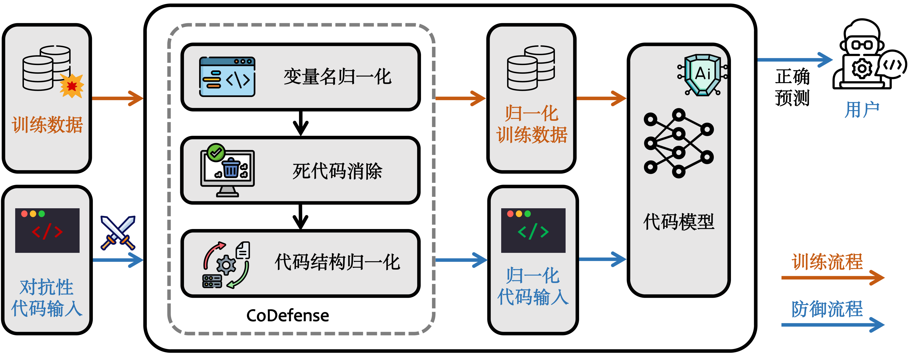

# CoDefense
## 1. Overview
--- ---


--- --- ---


## 2. Datasets

The datasets can be downloaded from this [Zenodo](https://zenodo.org/records/12583567). After decompressing this file, the folder structure is as follows.

```
├─Clone-detection
│  ├─CodeBERT
│  │  ├─alert
│  │  │      adv_test_1.txt
│  │  │      adv_test_2.txt
│  │  │      adv_train.txt
│  │  │      data.jsonl
│  │  │      test_1.txt
│  │  │      test_2.txt
│  │  │      valid.txt
│  │  │
│  │  ├─style
│  │  │      adv_test_1.txt
│  │  │      adv_test_2.txt
│  │  │      adv_train.txt
│  │  │      data.jsonl
│  │  │      test_1.txt
│  │  │      test_2.txt
│  │  │      valid.txt
│  │  │
│  │  └─wir
│  │          adv_test_1.txt
│  │          adv_test_2.txt
│  │          adv_train.txt
│  │          data.jsonl
│  │          test_1.txt
│  │          test_2.txt
│  │          valid.txt
│  │
│  ├─CodeGPT
│  │ ......    
│  │
│  └─PLBART
│    ......
│
└─Vulnerability-detection
  ......
```


## 3. Adv-Attack Techniques

- [ALERT](https://github.com/soarsmu/attack-pretrain-models-of-code/)
- [WIR-Random](https://github.com/ZZR0/ISSTA22-CodeStudy)
- [StyleTransfer](https://github.com/mdrafiqulrabin/JavaTransformer)


## 4. Experiments


### (1) Create Environment

```
pip install -r requirements.txt
```

### (2) Train Original Models

Use `train.py` to train models.

Take `CodeBERT/Clone-detection/code/train.py`  as an example:

```
import os

os.system("python run.py \
    --output_dir=../saved_models/ \
    --model_type=roberta \
    --config_name=microsoft/codebert-base \
    --model_name_or_path=microsoft/codebert-base \
    --tokenizer_name=microsoft/codebert-base \
    --do_train \
    --train_data_file=../../../Data/Clone-detection/train_sampled.txt \
    --eval_data_file=../../../Data/Clone-detection/valid_sampled.txt \
    --test_data_file=../../../Data/Clone-detection/test_sampled.txt \
    --epoch 2 \
    --block_size 400 \
    --train_batch_size 16 \
    --eval_batch_size 32 \
    --learning_rate 5e-5 \
    --max_grad_norm 1.0 \
    --evaluate_during_training \
    --seed 123456 2>&1")
```
And the model will be saved in `../saved_models`.

### (3) Run Adv-Attack Techniques

In our study, we employed three datasets: BigCloneBench for clone detection, OWASP for vulnerability detection, and CodeSearchNet for code summarization.

For pre-study, the Dataset is placed in `./Data` .

Take an example:

```
cd CodeBERT/Clone-detection/attack
python run_xxx.py
```

The `run_xxx.py` here can be `run_alert.py`, `run_style.py`, `run_wir.py`

Take `run_alert.py`  as an example:

```
import os

os.system("python attack_alert.py \
    --output_dir=../saved_models \
    --model_type=roberta \
    --tokenizer_name=microsoft/codebert-base \
    --model_name_or_path=microsoft/codebert-base \
    --csv_store_path ../result/codebert_clone_alert.csv \
    --base_model=microsoft/codebert-base-mlm \
    --use_ga \
    --eval_data_file=../../../Data/Clone-detection/test_sampled.txt \
    --block_size 512 \
    --eval_batch_size 256 \
    --seed 123456")
```

And the result will be saved in `../result/codebert_clone_alert.csv`.

Run experiments on other tasks of other models as well.

`./CodeBERT/` contains code for the CodeBERT experiment and `./CodeGPT` contains code for CodeGPT experiment and  `./PLBART ` contains code for PLBART experiment.

### (4) Adv-Retrain Models

In our study, we created a new training set `adv_train` and new test sets `adv_test1` and `adv_test2`, and divided the original test set equally into `test1` and `test2`.
You should download the Dataset from [Zenodo](https://zenodo.org/records/12583567) and place the file in the appropriate path. In Zenodo the Dataset is placed in the directory that corresponds to the code.

Use `train.py` to train models.

Take `CodeBERT/Clone-detection/code/train.py` for `wir` as an example:

```
import os

os.system("python run.py \
    --output_dir=../saved_models_codebert_clone_wir/ \
    --model_type=roberta \
    --config_name=microsoft/codebert-base \
    --model_name_or_path=microsoft/codebert-base \
    --tokenizer_name=microsoft/codebert-base \
    --do_train \
    --train_data_file=../../../adv_data/Clone-detection/CodeBERT/wir/adv_train.txt \
    --eval_data_file=../../../adv_data/Clone-detection/CodeBERT/wir/valid.txt \
    --epoch 2 \
    --block_size 400 \
    --train_batch_size 16 \
    --eval_batch_size 32 \
    --learning_rate 5e-5 \
    --max_grad_norm 1.0 \
    --evaluate_during_training \
    --seed 123456 2>&1")
```

And the retrained model will be saved in `../saved_models_codebert_clone_wir`.

### (5) Test Adv-Retrained Models

Take `CodeBERT/Clone-detection/code/test.py` for `wir` as an example:

```
import os

os.system("python run.py \
    --output_dir=../saved_models_codebert_clone_wir/ \
    --model_type=roberta \
    --config_name=microsoft/codebert-base \
    --model_name_or_path=microsoft/codebert-base \
    --tokenizer_name=roberta-base \
    --do_test \
    --train_data_file=../../../adv_data/Clone-detection/CodeBERT/wir/adv_train.txt \
    --eval_data_file=../../../adv_data/Clone-detection/CodeBERT/wir/valid.txt \
    --test_data_file=../../../adv_data/Clone-detection/CodeBERT/wir/xxx_test_2.txt \
    --epoch 2 \
    --block_size 400 \
    --train_batch_size 16 \
    --eval_batch_size 32 \
    --learning_rate 5e-5 \
    --max_grad_norm 1.0 \
    --evaluate_during_training \
    --seed 123456 2>&1")
```

The `xxx_test_2.txt` here can be `test_2.txt` to test the impact on the original model or be `adv_test_2.txt` to calculating the effect of defense.

The result will be saved in `../saved_models_codebert_clone_wir/prediction.txt`.

If you want to perform cross-validation, just change `saved_models_codebert_clone_wir` to `saved_models_codebert_clone_alert` or `saved_models_codebert_clone_style`, 
and the same goes for `alert` and `style`.

### (6) Model Defense with CoDefense
E.g., run the following commands to normalize the code:
```
cd Defense/;
python run.py;
```

In our study, we normalize data and get the new training set (`defense_train`), validation test (`defense_valid`) and test set (`defense_test`), and divided the new test set equally into `defense_test1` and `defense_test2`.

Use `train.py` to train new models.

Take `CodeBERT/Clone-detection/code/train.py` as an example:

In training phase, we should first retrain models based on normalized training data.
```
import os

os.system("python run.py \
    --output_dir=../saved_defense_models_codebert_clone_wir/ \
    --model_type=roberta \
    --config_name=microsoft/codebert-base \
    --model_name_or_path=microsoft/codebert-base \
    --tokenizer_name=microsoft/codebert-base \
    --do_train \
    --train_data_file=../../../defense_Data/Clone-detection/defense_train.txt \
    --eval_data_file=../../../defense_Data/Clone-detection/defense_valid.txt \
    --test_data_file=../../../defense_Data/Clone-detection/defense_test2.txt \
    --epoch 2 \
    --block_size 400 \
    --train_batch_size 16 \
    --eval_batch_size 32 \
    --learning_rate 5e-5 \
    --max_grad_norm 1.0 \
    --evaluate_during_training \
    --seed 123456 2>&1")
```

And the new model will be saved in `../saved_defense_models_codebert_clone_wir`.

In inference phase, we should load the new models to predict normalized code input.
```
import os

os.system("python run.py \
    --output_dir=../saved_defense_models_codebert_clone_wir/ \
    --model_type=roberta \
    --config_name=microsoft/codebert-base \
    --model_name_or_path=microsoft/codebert-base \
    --tokenizer_name=microsoft/codebert-base \
    --do_test \
    --train_data_file=../../../defense_Data/Clone-detection/defense_train.txt \
    --eval_data_file=../../../defense_Data/Clone-detection/defense_valid.txt \
    --test_data_file=../../../defense_Data/Clone-detection/defense_test2.txt \
    --epoch 2 \
    --block_size 400 \
    --train_batch_size 16 \
    --eval_batch_size 32 \
    --learning_rate 5e-5 \
    --max_grad_norm 1.0 \
    --evaluate_during_training \
    --seed 123456 2>&1")
```


## 5. Results

The results can be downloaded from this [Zenodo](https://zenodo.org/records/12583567). After decompressing this file, the folder structure is as follows.

```
├─alert
│      codebert_clone_alert.xlsx
│      codebert_vul_alert.xlsx
│      codegpt_clone_alert.xlsx
│      codegpt_vul_alert.xlsx
│      plbart_clone_alert.xlsx
│      plbart_vul_alert.xlsx
│
├─style
│      codebert_clone_style.xlsx
│      codebert_vul_style.xlsx
│      codegpt_clone_style.xlsx
│      codegpt_vul_style.xlsx
│      plbart_clone_style.xlsx
│      plbart_vul_style.xlsx
│
└─wir
        codebert_clone_wir.xlsx
        codebert_vul_wir.xlsx
        codegpt_clone_wir.xlsx
        codegpt_vul_wir.xlsx
        plbart_clone_wir.xlsx
        plbart_vul_wir.xlsx
```

Take `codebert_clone_alert.xlsx` as an example

The csv file contains 14 columns

- `Index: `The number of each sample, 0-3999.
- `Original Code: `The original code before the attack.
- `Adversarial Code: `The adversarial sample code obtained after attacking.
- `true_label: `The original true labels of the data.
- `pre_label: `The predicted labels of the original model.
- `adv_label: `Labels generated by adv attack on the original model.
- `Time Cost: `The time taken to reach this data.
- `success: `Whether the attack was successful (0 for success, 1 for failure).
- `model_label: `Labels generated by adv attack on the retrained model.
- `model_success: `Whether the adv attack on the retrained model successful(0 for success, 1 for failure).
- `wir_label: `Labels generated by adv attack on the retrained model using wir attack.
- `wir_success: `Whether the adv attack successful against the retrained model using the WIR attack(0 for success, 1 for failure).
- `style_label: `Labels generated by adv attack on the retrained model using style attack.
- `style_success: `Whether the adv attack successful against the retrained model using the WIR attack(0 for success, 1 for failure).

## 6. Acknowledgement

We are very grateful that the authors of CodeBERT, CodeGPT, PLBART, ALERT, WIR-Random, StyleTransfer make their code publicly available so that we can build this repository on top of their code. 
